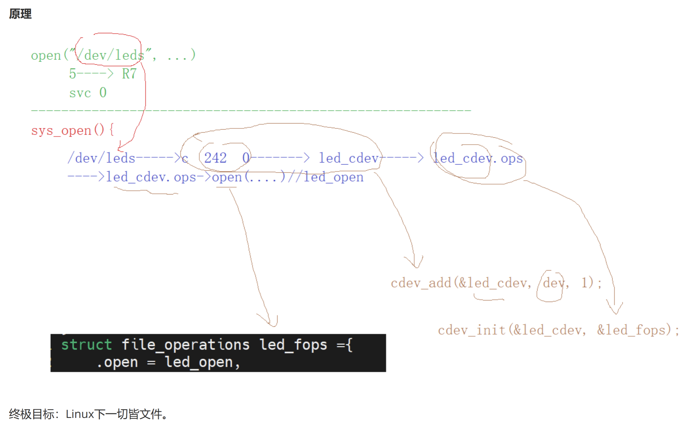

# **字符设备驱动套路（Linux 主流版本标准框架）**

## **字符设备驱动的通用标准框架**

字符设备驱动是 Linux 驱动中最基础的类型，其标准框架包含**五大核心要素**：

```
┌───────────────────────────────────────────────────────────────┐
│                Linux 字符设备驱动标准框架（主流 6.x）           │
│                                                               │
│   ① 设备号(dev_t)     ② 设备文件(/dev)      ③ file_operations  │
│        │                   ▲                    │             │
│        └──────────┐        │                    │             │
│                   ▼        │                    ▼             │
│             ④ cdev 字符设备对象 ──注册进内核 VFS──► 绑定操作集   │
│                                                               │
│   ⑤ 模块装载/卸载 (module_init / module_exit)                 │
└───────────────────────────────────────────────────────────────┘
```

| 要素 | 作用 | 主要 API（主流 6.x） | 一句话理解 |
| --- | --- | --- | --- |
| ① 设备号 `dev_t` | 主设备号标识哪一类驱动，次设备号标识哪一个设备 | `alloc_chrdev_region` / `register_chrdev_region`、`MAJOR`/`MINOR`/`MKDEV` | 驱动的"身份证" |
| ② 设备文件 `/dev/xxx` | 用户态 `open()` 的就是它，背后对应设备号 | `class_create` + `device_create`（udev/mdev 自动生成） | 驱动的"门牌号" |
| ③ 操作集 `file_operations` | 定义 open/read/write/release 等回调，用户态系统调用最终落在这里 | `struct file_operations` + 各回调函数 | 驱动的"接口表" |
| ④ cdev 字符设备对象 | 把设备号与操作集绑定，注册进内核 VFS | `cdev_init` + `cdev_add`（或 `cdev_device_add`） | 驱动的"接线端子" |
| ⑤ 模块装载/卸载 | 驱动的生命周期：加载时注册，卸载时注销 | `module_init` / `module_exit`、`MODULE_LICENSE` | 驱动的"开关" |

### ① 设备号（dev_t）

- **主设备号**：标识**哪一类**驱动；**次设备号**：标识该类下的**哪一个**具体设备
- 主流做法：用 `alloc_chrdev_region` **动态分配**，避免冲突；`cat /proc/devices` 可查看分配结果

```c
dev_t dev;
ret = alloc_chrdev_region(&dev, 0, 1, "leds");   // 动态分配 1 个设备号
printk("major=%d minor=%d\n", MAJOR(dev), MINOR(dev));
```

### ② 设备文件（/dev 节点）

- 用户态通过 `open("/dev/leds")` 访问驱动，节点背后绑定的就是设备号
- 主流版本用 **class + device_create 自动生成节点**（配合 udev/mdev），不再手动 `mknod`

```c
/* ⚠️ Linux 6.4 起 class_create 只有一个参数，owner 由内核自动设置 */
static struct class *led_class = class_create("led_class");
static struct device *led_device = device_create(led_class, NULL, dev, NULL, "leds");
```

### ③ file_operations 操作集

```c
static struct file_operations led_fops = {
    .owner   = THIS_MODULE,
    .open    = led_open,
    .release = led_release,
    .read    = led_read,
    .write   = led_write,
    // .unlocked_ioctl = led_ioctl,   // 自定义控制命令
    // .llseek / .mmap / .poll / .fasync ...
};
```

### ④ cdev 字符设备对象

- 主流推荐：把 `struct cdev` **内嵌**进私有设备结构体（而不是单独 `cdev_alloc`），便于挂载私有数据
- 可用内核封装好的 `cdev_device_add()` / `cdev_device_del()` 一步完成注册/注销

```c
struct led_dev {
    struct cdev cdev;            /* 内嵌 cdev */
    struct gpio_desc *led_gpio;  /* 私有数据：GPIO、互斥锁等 */
    struct mutex lock;
};

cdev_init(&led_dev->cdev, &led_fops);
led_dev->cdev.owner = THIS_MODULE;
ret = cdev_device_add(&led_dev->cdev, dev);   // = cdev_add + device_add
```

### ⑤ 模块装载 / 卸载

```c
module_init(led_drv_init);   // 加载：按顺序注册 ① ② ③ ④
module_exit(led_drv_exit);   // 卸载：逆序注销 ④ ③ ② ①
MODULE_LICENSE("GPL");
```

> **核心思想：init 的申请顺序 = exit 的释放逆序，后申请的先释放。**

---

## **用户空间程序调用对应驱动函数：**

1. 确定该驱动程序中的 cdev 绑定的设备号是多少？（`cat /proc/devices` 确定主设备号 + 分析驱动代码确定次设备号）
2. 若未自动生成节点，可用 `mknod /dev/leds c <major> <minor>` 手动创建设备文件
3. 在应用程序中通过 `open` 打开该设备文件，后续 `read` / `write` 等操作即调用到相应驱动函数



---

## **主流版本（6.x）与旧版本 API 对照**

| 旧版本写法 | 主流版本写法（6.x） | 变化说明 |
| --- | --- | --- |
| `class_create(THIS_MODULE, "xx")` | `class_create("xx")` | 6.4 起移除 owner 参数 |
| `cdev_alloc()` 单独分配 | 内嵌 `struct cdev` + `cdev_init` | 主流推荐结构体内嵌 |
| `cdev_add()` + `device_create()` | `cdev_device_add()` | 内核辅助函数，合二为一 |
| `cdev_del()` + `device_destroy()` | `cdev_device_del()` | 注销也一步到位 |
| `gpio_request()` / `gpio_set_value()` | `devm_gpiod_get()` / `gpiod_set_value()` | 旧整数 GPIO → 新描述符 `gpiod_*` API |
| `setup_timer()` | `timer_setup()` + `from_timer()` | 4.15 起的新定时器 API |

## **LED 驱动（led_drv.c）脉络分析**

这是一个 **LED 字符设备驱动**，在标准套路基础上扩展了 GPIO 操作、定时器流水灯和用户交互功能。

> 📌 该 `led_drv.c` 是**教材式写法**（`cdev_alloc` + 遗留整数 GPIO API + `class_create(THIS_MODULE,...)`），能跑但 API 偏旧；与主流 6.x 写法的差异见上文「主流版本 API 对照」表。

### 一、整体架构

```
┌──────────────────────────────────────────────────┐
│                  用户空间 (app)                     │
│    echo on > /dev/leds     cat /dev/leds         │
└────────────────┬─────────────────────────────────┘
                 │ 系统调用 (open/read/write/close)
                 ▼
┌──────────────────────────────────────────────────┐
│       内核空间 — file_operations 回调              │
│  led_open → led_read → led_write → led_release   │
└────────────────┬─────────────────────────────────┘
                 │
┌────────────────┴─────────────────────────────────┐
│             硬件操作 (GPIO)                        │
│  LD1(PE10)  LD2(PF10)  LD3(PE8)                  │
└──────────────────────────────────────────────────┘
```

### 二、初始化流程（`led_drv_init`）

| 步骤            | 函数                                         | 说明                                                        |
| --------------- | -------------------------------------------- | ----------------------------------------------------------- |
| ① 分配设备号   | `alloc_chrdev_region`                      | **动态分配**，避免主设备号冲突                        |
| ② 分配 cdev    | `cdev_alloc`                               | 在堆上分配 cdev 结构体                                      |
| ③ 初始化 cdev  | `cdev_init`                                | 绑定`led_fops` 到 cdev                                    |
| ④ 注册 cdev    | `cdev_add`                                 | 将 cdev 加入内核，建立 设备号↔fops 映射                    |
| ⑤ 创建 class   | `class_create`                             | 在`/sys/class/` 下创建 `led_class`                      |
| ⑥ 创建设备     | `device_create`                            | **自动**在 `/dev/` 生成 `leds` 节点（无需 mknod） |
| ⑦ 申请 GPIO    | `gpio_request` + `gpio_direction_output` | 配置三个 LED 引脚为输出，初始常亮                           |
| ⑧ 初始化定时器 | `timer_setup`                              | 绑定回调`led_chaser_timer`，但暂不启动                    |

> 相比于"最小套路"，这里通过 **class + device_create** 实现了设备节点**自动创建**，省去了手动 `mknod` 的麻烦。
>
> ⚠️ **对照主流 6.x 版本需注意**：① `class_create(THIS_MODULE, "led_class")` 应改为 `class_create("led_class")`（6.4 起单参数）；② `cdev_alloc` 单独分配建议改为**内嵌进私有结构体**；③ 遗留的 `gpio_request` 系列建议迁移到 **`gpiod_*` 描述符 API**；④ 注册/注销可改用 `cdev_device_add()` / `cdev_device_del()`。

### 三、文件操作接口

| 回调            | 触发时机               | 行为                                                    |
| --------------- | ---------------------- | ------------------------------------------------------- |
| `led_open`    | `open("/dev/leds")`  | 点亮 LD1，启动流水灯定时器（每 0.33s 切换）             |
| `led_read`    | `read("/dev/leds")`  | 停止定时器，返回三个 GPIO 的当前电平`"1 0 1\n"`       |
| `led_write`   | `write("/dev/leds")` | 停止定时器；写入`"on"` → 只亮 LD2；`"off"` → 全灭 |
| `led_release` | `close("/dev/leds")` | 停止定时器，三个 LED 恢复常亮                           |

### 四、定时器流水灯机制

```
led_open 时启动
    │
    ▼
led_chaser_timer (每 0.33 秒触发)
    │
    ├── 全部熄灭
    ├── 点亮 led_idx 对应的灯
    └── led_idx++，重新注册定时器
    │
    ▼
被 read/write/close 时 → del_timer 停止
```

- `mod_timer(&led_timer, jiffies + HZ/3)` — 实现周期执行
- 优先级：**write/read > open/定时器**（用户手动操作时自动停止流水灯）

### 五、卸载流程（`led_drv_exit`）

```
del_timer → 关灯 → gpio_free → device_destroy → class_destroy → cdev_del → unregister_chrdev_region
```

与初始化完全对称，确保资源全部释放。

> **主流版本简化**：若 cdev 内嵌在私有结构体中，可用 `cdev_device_del(&dev->cdev)` 一次完成 `cdev_del` + `device_destroy`；GPIO 改用 `devm_gpiod_*` 后连 `gpio_free` 都可省去。

### 六、关键设计要点

1. **动态设备号**：用 `alloc_chrdev_region` 而非 `register_chrdev_region`，由内核自动分配，避免冲突
2. **自动创建设备节点**：`class_create` + `device_create` 配合 udev/mdev，无需手动 `mknod`（注意 6.4+ 的 `class_create` 已改为单参数）
3. **写操作字符串解析**：用户态通过 `echo on > /dev/leds` 控制，驱动内用 `strncmp` 解析命令
4. **读操作返回状态**：用户态通过 `cat /dev/leds` 查看三个 LED 的 GPIO 电平
5. **定时器资源竞争**：`read/write/release` 中都调用 `del_timer`，确保离开后定时器不再触发

## **你实际写代码的顺序**

从 `led_drv.c` 的代码布局可以看出来，你并不是从上写到下的，而是按这个顺序搭框架：

```
Step ① 硬件资源定稿
  └── #define LD1 74    // 先想好硬件引脚、数量、常量
      #define LD2 90
      static const int led_pins[] = { ... }

Step ② file_operations 骨架
  └── static struct file_operations led_fops = {   // 先搭框架！
          .open    = led_open,
          .release = led_release,
          .write   = led_write,
          .read    = led_read,
      };
      // 此时回调函数还是空壳，但框架已经清晰

Step ③ 逐个填回调函数体
  └── led_open     → 放行 open 时的逻辑
      led_release  → 放行 close 时的逻辑
      led_write    → 放行 write 时的逻辑
      led_read     → 放行 read 时的逻辑

Step ④ 字符设备注册流水线 (init)
  └── alloc_chrdev_region → cdev_init(内嵌) → cdev_add
      → class_create → device_create
      → gpio_request → gpio_direction_output
      → timer_setup
      // 6.x 可精简：cdev_device_add 一步注册 / GPIO 用 gpiod_* 描述符 API

Step ⑤ 字符设备注销流水线 (exit)
  └── 与 init 完全对称，反向操作

Step ⑥ 额外功能补齐
  └── 定时器回调 led_chaser_timer
      module_init / module_exit 宏

Step ⑦ 老版本归档（#if 0 区域）
  └── 静态注册版本留着做对比参考
```

### 你的编码风格特点

- **自上而下搭骨架**：先声明结构体，再补函数体（像写文章先列提纲）
- **init/exit 对称**：exit 就是 init 的逆序，不容易漏资源
- **老版本保留**：`#if 0` 保留历史代码做对比参考

---

## **通用字符设备驱动编码套路（可应对任何驱动）**

无论写什么外设驱动（LED、按键、I2C、SPI、UART、PWM...），都按这个流程走：

### Phase 1：硬件规划（先想清楚物理资源）

```c
#define XXX_PIN  xx          // 硬件引脚/地址
#define XXX_NUM  n           // 设备数量
static const int xxx_pins[] = { ... };
// ... 其他硬件相关常量、数据结构
```

> **这一步决定了驱动要控制什么**，是地基。

### Phase 2：file_operations 骨架 + 回调函数

```c
// 2a. 先声明 fops 结构体（搭框架）
static struct file_operations xxx_fops = {
    .owner   = THIS_MODULE,
    .open    = xxx_open,
    .release = xxx_release,
    .read    = xxx_read,
    .write   = xxx_write,
    // .unlocked_ioctl = xxx_ioctl,  // 复杂控制需要
};

// 2b. 再逐个实现回调（填血肉）
static int xxx_open(struct inode *inode, struct file *filp) { ... }
static int xxx_release(...) { ... }
static ssize_t xxx_read(...) { ... }
static ssize_t xxx_write(...) { ... }
```

> **这是驱动的灵魂**，用户态的所有操作最终落地到这里。

### Phase 3：init/exit 对称流水线

**init 中资源的申请顺序**，就是 **exit 中资源的释放逆序**：

```
init:                           exit:
┌─────────────────────┐        ┌──────────────────────┐
│ alloc_chrdev_region │        │ unregister_...       │ ← 最后申请的最先释放
│ cdev_alloc / init   │        │ cdev_del             │
│ cdev_add            │        │ device_destroy       │
│ class_create        │        │ class_destroy        │
│ device_create       │        │ gpio_free            │
│ gpio_request        │        │ kfree / iounmap      │
│ ... 其他资源         │        │ ...                  │
└─────────────────────┘        └──────────────────────┘
                                    ↑ 把 init 倒过来写就对了
```

> **对称性**是内核驱动的基本修养，记住：**后申请的先释放**。

### Phase 4：错误处理（每一行都要想"如果失败了怎么办"）

```c
ret = alloc_chrdev_region(&dev, 0, 1, "xxx");
if (ret < 0) goto fail_alloc;      // 第1步失败 → 无需清理

ret = cdev_add(led_cdev, dev, 1);
if (ret < 0) goto fail_cdev_add;   // 第2步失败 → 回退第1步

// ... 后续每步失败都 goto 到对应标签，清理之前已成功的步骤
```

> 标准的 **goto error handling** 模式，看起来丑陋但 Linux 内核就是这样写的。

### Phase 5：主流版本（6.x）标准框架完整示例

把上面所有套路落成一份主流版本风格的完整代码（内嵌 cdev + gpiod + 6.x 单参数 `class_create` + goto 错误处理）：

```c
#include <linux/init.h>
#include <linux/module.h>
#include <linux/fs.h>
#include <linux/cdev.h>
#include <linux/device.h>
#include <linux/gpio/consumer.h>
#include <linux/mutex.h>
#include <linux/slab.h>

#define LED_CNT  1
#define LED_NAME "leds"

/* 私有设备结构体：内嵌 cdev，统一管理私有数据（主流推荐写法） */
struct led_dev {
    struct cdev cdev;            /* ④ cdev 内嵌 */
    struct class *class;         /* ② class */
    struct device *device;       /* ② 设备节点 */
    dev_t devt;                  /* ① 设备号 */
    struct gpio_desc *led_gpio;  /* 硬件：GPIO 描述符 */
    struct mutex lock;           /* 并发保护 */
};

static struct led_dev *g_led;

/* ---- ③ file_operations 回调 ---- */
static int led_open(struct inode *inode, struct file *filp)
{
    struct led_dev *dev = container_of(inode->i_cdev, struct led_dev, cdev);
    filp->private_data = dev;              /* 私有数据挂到 file 上 */
    return 0;
}

static ssize_t led_write(struct file *filp, const char __user *buf,
                         size_t count, loff_t *ppos)
{
    struct led_dev *dev = filp->private_data;
    char val;

    if (copy_from_user(&val, buf, 1))
        return -EFAULT;

    mutex_lock(&dev->lock);
    gpiod_set_value(dev->led_gpio, val == '1');  /* 写 '1' 亮 / '0' 灭 */
    mutex_unlock(&dev->lock);
    return count;
}

static struct file_operations led_fops = {
    .owner   = THIS_MODULE,
    .open    = led_open,
    .write   = led_write,
};

/* ---- ⑤ 模块装载 / 卸载 ---- */
static int __init led_init(void)
{
    int ret;
    dev_t dev;

    /* ① 设备号：动态分配 */
    ret = alloc_chrdev_region(&dev, 0, LED_CNT, LED_NAME);
    if (ret < 0)
        return ret;

    g_led = kzalloc(sizeof(*g_led), GFP_KERNEL);   /* 申请私有结构体 */
    if (!g_led) {
        unregister_chrdev_region(dev, LED_CNT);
        return -ENOMEM;
    }
    mutex_init(&g_led->lock);

    /* ④ cdev：内嵌初始化 + 注册 */
    cdev_init(&g_led->cdev, &led_fops);
    g_led->cdev.owner = THIS_MODULE;
    ret = cdev_add(&g_led->cdev, dev, LED_CNT);
    if (ret < 0)
        goto err_cdev;

    /* ② 设备文件：class + device 自动生成 /dev/leds */
    /* ⚠️ Linux 6.4+ 的 class_create 只有一个参数 */
    g_led->class = class_create(LED_NAME);
    if (IS_ERR(g_led->class)) {
        ret = PTR_ERR(g_led->class);
        goto err_class;
    }
    g_led->device = device_create(g_led->class, NULL, dev, NULL, LED_NAME);
    if (IS_ERR(g_led->device)) {
        ret = PTR_ERR(g_led->device);
        goto err_device;
    }

    /* 硬件：gpiod 描述符 API（可配合设备树 "led-gpios"） */
    g_led->led_gpio = gpiod_get(&g_led->device->dev, "led", GPIOD_OUT_LOW);
    if (IS_ERR(g_led->led_gpio)) {
        ret = PTR_ERR(g_led->led_gpio);
        goto err_gpio;
    }

    g_led->devt = dev;
    return 0;

err_gpio:
    device_destroy(g_led->class, dev);
err_device:
    class_destroy(g_led->class);
err_class:
    cdev_del(&g_led->cdev);
err_cdev:
    unregister_chrdev_region(dev, LED_CNT);
    kfree(g_led);
    return ret;
}

static void __exit led_exit(void)
{
    dev_t dev = g_led->devt;

    gpiod_put(g_led->led_gpio);             /* 释放 GPIO */
    device_destroy(g_led->class, dev);
    class_destroy(g_led->class);
    cdev_del(&g_led->cdev);                 /* ④ 注销 cdev */
    unregister_chrdev_region(dev, LED_CNT); /* ① 注销设备号 */
    kfree(g_led);
}

module_init(led_init);
module_exit(led_exit);
MODULE_LICENSE("GPL");
```

> 若换成 `platform_driver` + 设备树，硬件资源改在 `probe()` 里用 `devm_gpiod_get(&pdev->dev, "led", ...)` 获取，配合 `devm_` API，`remove()` 甚至可以什么都不写。

---

## **更规范的流程补充**

你的流程已经很好了，下面是**工业级驱动**通常会额外考虑的环节：

### ① 设备树（Device Tree）匹配

现代 Linux 驱动不再硬编码 GPIO 号，而是从设备树解析：

```c
static const struct of_device_id xxx_of_match[] = {
    { .compatible = "mycompany,mydevice" },
    { },
};
MODULE_DEVICE_TABLE(of, xxx_of_match);

static int xxx_probe(struct platform_device *pdev)
{
    // 从设备树获取 GPIO、中断号、时钟等（主流用 gpiod 描述符 API）
    struct gpio_desc *gpio = devm_gpiod_get(&pdev->dev, "led", GPIOD_OUT_LOW);
}
```

### ② 使用 `xxx_probe` / `xxx_remove` 替代手写 init/exit

```c
static struct platform_driver xxx_driver = {
    .probe  = xxx_probe,
    .remove = xxx_remove,
    .driver = {
        .name = "mydevice",
        .of_match_table = xxx_of_match,
    },
};
module_platform_driver(xxx_driver);  // 一行代替 module_init/exit
```

这样内核自动管理驱动的加载/卸载时机。

### ③ 使用 `devm_` 系列 API（自动资源管理）

```c
// devm_ = device managed — 驱动卸载时自动释放，不需要手写 cleanup
devm_gpiod_get(dev, "led", GPIOD_OUT_LOW);  // 替代 gpio_request（gpiod 新 API）
devm_ioremap_resource(dev, res);            // 替代 ioremap
devm_kzalloc(dev, size, GFP_KERNEL);       // 替代 kmalloc
```

> 用了 `devm_` 后，**remove 函数甚至可以什么都不写**，内核自动帮你收拾。注意：主流 6.x 推荐用 **`gpiod_*`（描述符 API）** 取代旧的整数 `gpio_request` 系列。

### ④ 完整的 file_operations 补充

实际驱动还常用的回调：

| 回调                | 用途             | 典型场景             |
| ------------------- | ---------------- | -------------------- |
| `.unlocked_ioctl` | 自定义控制命令   | 设置波特率、改变模式 |
| `.llseek`         | 文件定位         | 读写位置偏移         |
| `.mmap`           | 内存映射         | 帧缓冲、DMA 缓冲区   |
| `.poll`           | 阻塞等待事件     | 按键中断、数据可读   |
| `.fasync`         | 异步通知（信号） | 数据就绪时发 SIGIO   |

### ⑤ 互斥与并发保护

多进程同时 open 时，GPIO/定时器会打架：

```c
static struct mutex led_mutex;

static int led_open(struct inode *inode, struct file *filp)
{
    if (!mutex_trylock(&led_mutex))   // 非阻塞获取锁
        return -EBUSY;                // 已被其他进程打开
    // ... 
}

static int led_release(...)
{
    mutex_unlock(&led_mutex);
}
```

### ⑥ 常用驱动注册方式对比（选型）

| 场景 | 推荐方式 | 说明 |
| --- | --- | --- |
| 学习 / 简单演示 | 手写 `module_init/exit` + cdev | 结构最清晰，便于理解五大要素 |
| 真实产品驱动 | `platform_driver` + 设备树 | 硬件资源由设备树描述，probe/remove 管理 |
| 工业级简化 | `devm_*` + `cdev_device_add` | 自动资源管理，卸载最省心 |

---

## **你写任何驱动的万能 Checklist**

- [ ] 硬件资源定义好了吗？（引脚、地址、数量）
- [ ] `file_operations` 骨架搭好了吗？
- [ ] 回调函数都填了吗？（open/close/read/write + 需要时 ioctl/poll/mmap）
- [ ] init 函数按顺序申请资源了吗？
- [ ] **每步申请都有错误处理吗？**
- [ ] exit 函数是 init 的逆序吗？
- [ ] 用了 `class_create`（6.4+ 单参数）+ `device_create` 自动创建设备节点吗？
- [ ] 需要并发保护吗？（mutex/spinlock）
- [ ] 考虑用 `devm_` API 简化资源管理吗？
- [ ] 考虑用 `platform_driver` + 设备树更规范吗？

| 控制方式         | 用户态操作              | 驱动行为               |
| ---------------- | ----------------------- | ---------------------- |
| open → 自动流水 | `./app` (open)        | 流水灯自动循环         |
| 手动控制         | `echo on > /dev/leds` | 停止流水，只亮 LD2     |
| 读取状态         | `cat /dev/leds`       | 停止流水，返回电平状态 |
