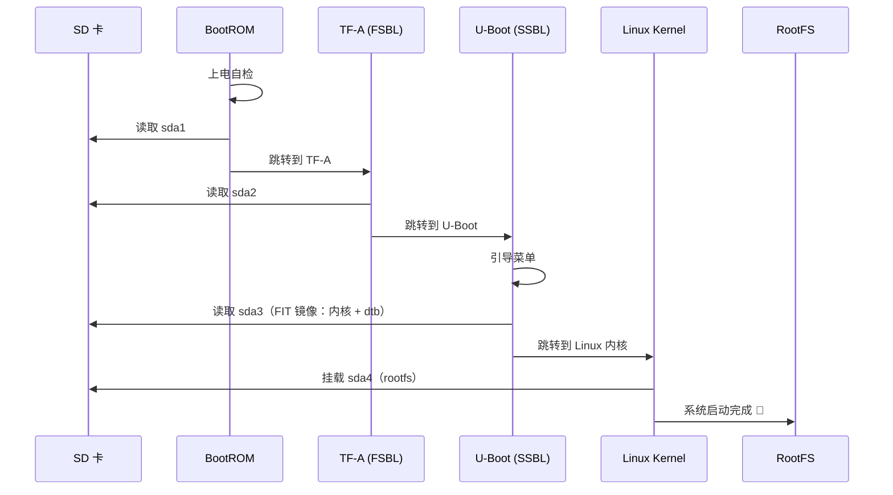

# STM32MP157 Bring Up 完整流程

## 一、启动流程概览

### 核心链路

```
BootROM → TF-A (FSBL) → U-Boot (SSBL) → Linux Kernel → RootFS
```

### 各阶段说明

| 阶段                    | 加载者   | 说明                                       |
| ----------------------- | -------- | ------------------------------------------ |
| **BootROM**       | 芯片固件 | STM32MP157 出厂固件，启动后查找 SD 卡/eMMC |
| **TF-A** (FSBL)   | BootROM  | ARM Trusted Firmware，初始化 DDR、时钟     |
| **U-Boot** (SSBL) | TF-A     | 引导加载程序，加载内核和设备树             |
| **Linux Kernel**  | U-Boot   | 解压运行                                   |
| **RootFS**        | Kernel   | 挂载根文件系统                             |

### 时序图




---

## 二、各阶段职责详解

### 完整流水线

```
┌─────────────────────────────────────────────────────────────────────────┐
│  ① 拨码开关 ── 硬件引脚电平，决定 BootROM 从哪个介质读 TF-A            │
│     ↓                                                                  │
│  ② BootROM ── 芯片内部固件，无串口输出，几毫秒完成                      │
│     ↓                                                                  │
│  ③ TF-A (FSBL) ── 初始化 DDR、时钟，从同一介质加载 U-Boot              │
│     ↓                                                                  │
│  ④ U-Boot (SSBL) ── 引导加载程序，提供三种工作模式                     │
│     ├─ 自动模式 → 从"自己所在介质"读 sda3 分区的 FIT 镜像              │
│     ├─ ums 命令 → 把介质映射成 U 盘，给 PC 烧录用                     │
│     └─ 手动模式 → 自己敲命令指定从哪个设备加载                         │
│     ↓                                                                  │
│  ⑤ Linux 内核 ── 解压运行                                              │
│     ↓                                                                  │
│  ⑥ 挂载 RootFS ── 挂载 sda4 分区                                      │
└─────────────────────────────────────────────────────────────────────────┘
```

### 拨码开关的角色

| 拨码状态  | BootROM 动作                      | 后续接力                      |
| --------- | --------------------------------- | ----------------------------- |
| SD 卡模式 | 从`mmc 0`（SD 卡）sda1 读 TF-A  | TF-A → SD 卡读 U-Boot → ... |
| eMMC 模式 | 从`mmc 1`（eMMC）第1分区读 TF-A | TF-A → eMMC 读 U-Boot → ... |

> **关键理解**：拨码盘**只决定 BootROM 去哪找 TF-A**，之后的 TF-A → U-Boot → 内核默认在同一介质上接力完成。但 U-Boot 启动后可以手动干预。

### U-Boot 的三种模式

| 模式     | 触发方式                   | 用途                                       |
| -------- | -------------------------- | ------------------------------------------ |
| 自动引导 | 上电后倒计时结束自动执行   | 从预定分区读取内核+dtb，正常启动 Linux     |
| UMS 模式 | 在 U-Boot 命令行输入       | 把存储介质映射为 U 盘，供 PC 端 dd 烧录    |
| 手动模式 | 倒计时内按任意键进入命令行 | 手动敲命令指定内核/dtb 来源，用于调试/开发 |

> `ums` 只是烧录辅助工具，**跟系统引导没有关系**。

### 跨介质加载：从 eMMC 启动 U-Boot，从 SD 卡加载内核

场景：拨码盘拨到 eMMC 模式，但内核和 dtb 放在 SD 卡上。U-Boot 启动后手动操作：

```bash
# 1. 切换到 SD 卡（mmc 0）
STM32MP> mmc dev 0

# 2. 从 SD 卡 sda3 分区读取内核到内存
STM32MP> ext4load mmc 0:3 0xc2000000 uImage

# 3. 从 SD 卡 sda3 分区读取设备树到内存
STM32MP> ext4load mmc 0:3 0xc4000000 stm32mp157d-atk.dtb

# 4. 手动启动内核
STM32MP> bootm 0xc2000000 - 0xc4000000
```

> 前提：U-Boot 有 `mmc` 和 `ext4` 文件系统支持。如果 sda3 是 FIT 格式（内核+dtb 打包在一起），直接用 `bootm` 启动 FIT 镜像即可。

---

## 三、SD 卡分区布局

### 典型嵌入式分区表（物理偏移）

| 分区                                        | 起始块（典型值）    | 说明                       |
| ------------------------------------------- | ------------------- | -------------------------- |
| fsbl1（First Stage Boot Loader）            | 0x0000 ~ 0x03FF     | 第一阶段引导程序           |
| fsbl2                                       | 0x0400 ~ 0x07FF     | 第二阶段引导程序备份       |
| ssbl（Second Stage Boot Loader，如 U-Boot） | 0x0800 ~ 0x0FFF     | 第二阶段引导程序（U-Boot） |
| **uImage / kernel**                   | **0x1000 起** | **内核镜像存放位置** |
| rootfs                                      | uImage 之后         | 根文件系统                 |

### GPT 分区布局（本板实际）

```
sda1  →  236.5K    TF-A (FSBL)              ← BootROM 加载（裸二进制）
sda2  →  236.5K    U-Boot (SSBL)            ← TF-A 加载（裸二进制）
sda3  →  2M        FIT 镜像（内核+设备树）    ← U-Boot 加载
sda4  →  29.7G     根文件系统 RootFS          ← 内核挂载
```

### 分区说明

| 分区 | 文件系统 | 存储内容         | 由谁加载   | 说明                                 |
| ---- | -------- | ---------------- | ---------- | ------------------------------------ |
| sda1 | 裸二进制 | `tf-a.stm32`   | BootROM    | TF-A（FSBL），BootROM 直接读取裸数据 |
| sda2 | 裸二进制 | `u-boot.stm32` | TF-A       | U-Boot（SSBL），TF-A 加载            |
| sda3 | ext4/FIT | 内核 + 设备树    | U-Boot     | FIT 镜像或独立 uImage + dtb          |
| sda4 | ext4     | 根文件系统       | Linux 内核 | 挂载为`/`                          |

> 可以通过修改分区表调整各分区大小。

---

## 四、PC 端准备工作

| 步骤 | 做什么                                            | 产出物                                         |
| ---- | ------------------------------------------------- | ---------------------------------------------- |
| 1    | 获取/编译**TF-A**（ARM Trusted Firmware-A） | `tf-a-stm32mp157x-xxx.stm32`                 |
| 2    | 获取/编译**U-Boot**                         | `u-boot-stm32mp157x-xxx.stm32`               |
| 3    | 获取/编译**Linux 内核**                     | `uImage` / `zImage` + `*.dtb`            |
| 4    | 编写/配置**设备树** `.dts`                | `stm32mp157x-xxx.dtb`                        |
| 5    | 制作**根文件系统**                          | rootfs（BusyBox / Yocto / Buildroot / Debian） |

> 实际开发中通常用 ST 官方的 **OpenSTLinux** 或 **Yocto/Buildroot** 一键构建。

---

## 五、烧录到 SD 卡

### 整盘备份

```bash
sudo dd if=/dev/sda of=stm32mp157_sd_backup.img bs=4M status=progress
```

### 整盘还原（烧录新卡）

```bash
sudo dd if=stm32mp157_sd_backup.img of=/dev/sdX bs=4M status=progress
```

### 单分区烧录（推荐）

```bash
sudo dd if=tf-a.stm32    of=/dev/sda1 bs=1M
sudo dd if=u-boot.stm32  of=/dev/sda2 bs=1M
# sda3（内核+dtb）和 sda4（rootfs）推荐通过文件系统拷贝，或用整盘还原
```

### Bootloader 单独备份

```bash
sudo dd if=/dev/sda1 of=boot_sda1.bin bs=512
sudo dd if=/dev/sda2 of=boot_sda2.bin bs=512
sudo dd if=/dev/sda3 of=boot_sda3.bin bs=512
```

### rootfs 用 tar 打包（更小更快）

```bash
sudo tar -czf rootfs.tar.gz -C /media/phy/rootfs .
```

---

## 六、烧录到 eMMC

### 方式一：U-Boot UMS 模式（PC 端操作）

在开发板 U-Boot 命令行输入：

```
STM32MP> ums 0 mmc 1
```

| 参数      | 含义                                        |
| --------- | ------------------------------------------- |
| `ums`   | USB Mass Storage（模拟为 U 盘）             |
| `0`     | USB 控制器 0（OTG 口）                      |
| `mmc 1` | eMMC（`mmc 0` = SD 卡，`mmc 1` = eMMC） |

PC 端识别为 `/dev/sdX` 后，用 `dd` 写入（参考第五节命令）。

### 方式二：SD 卡启动后板内烧录（开发板内操作）

SD 卡启动进入 Linux 后执行：

```bash
dd if=/home/root/tf-a.stm32     of=/dev/mmcblk0p1
dd if=/home/root/u-boot.stm32   of=/dev/mmcblk0p2
dd if=/dev/mmcblk1p4            of=/dev/mmcblk0p4   # rootfs 直接复制
```

> `mmcblk0` = eMMC, `mmcblk1` = SD 卡（具体编号因内核配置而异）

---

## 七、上电调试

### 串口参数

```
波特率：115200
数据位：8
停止位：1
校验：无
硬件流控：无
```

### 各阶段输出观察

```
1. BootROM      → （无输出或极少）
2. TF-A (BL2)   → "NOTICE: BL2: v2.6..."
3. U-Boot       → "U-Boot 2022.10..." → "STM32MP>"
4. Linux Kernel → "Starting kernel..." / "Booting Linux..."
5. RootFS       → login 提示符
```

---

## 八、常见故障排查

| 现象                               | 可能原因                | 排查方向                       |
| ---------------------------------- | ----------------------- | ------------------------------ |
| 串口无输出                         | 供电不足 / 拨码开关不对 | 检查电源和启动模式引脚         |
| 卡在 BootROM                       | TF-A 没烧对位置         | 确认 sda1 起始位置正确         |
| 卡在 TF-A                          | DDR 配置错误            | 核对 TF-A 的 DDR 参数          |
| 卡在 "Starting kernel..."          | 设备树或内核配置问题    | 检查 dtb 匹配度                |
| Kernel panic - not syncing         | 无法挂载 rootfs         | 检查内核 cmdline 的 root= 参数 |
| Kernel panic - VFS unable to mount | rootfs 格式或内容损坏   | 检查 rootfs 制作过程           |
| 看门狗反复复位                     | IWDG/WWDG 未关闭        | 在设备树中 disable             |

---

## 九、设备树修改（以关闭看门狗为例）

### 方式一：修改 DTS 源码（推荐）

```dts
&iwdg1 {
    status = "disabled";   /* 关闭独立看门狗1 */
};

&iwdg2 {
    status = "disabled";   /* 关闭独立看门狗2 */
};
```

设备树相关节点：

| 节点       | 说明        |
| ---------- | ----------- |
| `&iwdg1` | 独立看门狗1 |
| `&iwdg2` | 独立看门狗2 |
| `&wwdg1` | 窗口看门狗1 |
| `&wwdg2` | 窗口看门狗2 |

### 方式二：反编译已有 dtb（无需内核源码）

```bash
# 1. 查找 dtb
find /boot -name "*.dtb"

# 2. 反编译
dtc -I dtb -O dts stm32mp157d-atk.dtb -o stm32mp157d-atk.dts

# 3. 编辑 dts，添加 &iwdg2 { status = "disabled"; };

# 4. 重新编译
dtc -I dts -O dtb stm32mp157d-atk.dts -o stm32mp157d-atk_new.dtb

# 5. 替换
cp stm32mp157d-atk_new.dtb /boot/stm32mp157d-atk.dtb
```

---

## 附1：dd 常用速查

| 用途         | 命令                                                   |
| ------------ | ------------------------------------------------------ |
| 整盘备份     | `dd if=/dev/sda of=backup.img bs=4M status=progress` |
| 整盘还原     | `dd if=backup.img of=/dev/sda bs=4M status=progress` |
| 烧录 ISO     | `dd if=ubuntu.iso of=/dev/sdb bs=4M status=progress` |
| 克隆硬盘     | `dd if=/dev/sda of=/dev/sdb bs=4M status=progress`   |
| 擦除全盘     | `dd if=/dev/zero of=/dev/sda bs=1M`                  |
| 生成测试文件 | `dd if=/dev/zero of=test.bin bs=1M count=100`        |
| 备份 MBR     | `dd if=/dev/sda of=mbr.bin bs=512 count=1`           |
| 测试写速度   | `dd if=/dev/zero of=/tmp/test bs=1M count=1000`      |

### ⚠️ 注意

- `dd` 操作前务必确认 `of=` 的目标，写错会直接覆盖数据
- 备份前先 `sync` 确保数据落盘
- 建议 `dd` 前卸载分区（`umount`），保持数据一致性
- 整盘 `dd` 会拷贝所有数据包括空块，体积大；用 `tar` 打包 rootfs 更小更快

---

## 附2：其他设备启动流程对比

所有现代设备都遵循同一核心模式，但复杂度差异很大：

```
ROM Code → 第一阶段引导 → 第二阶段引导 → OS 内核
```

### 对比表格

| 环节               | STM32MP157           | PC (x86/UEFI)                          | 大型服务器              |
| ------------------ | -------------------- | -------------------------------------- | ----------------------- |
| **ROM Code** | BootROM（芯片固件）  | UEFI 固件（Flash 芯片）                | UEFI + BMC（双固件）    |
| **FSBL**     | TF-A（~200K）        | UEFI 第一阶段                          | UEFI + 基板管理控制器   |
| **SSBL**     | U-Boot（~1M）        | GRUB/systemd-boot/Windows Boot Manager | GRUB2 / PXE 网络启动    |
| **内核加载** | U-Boot 读取 FIT 镜像 | GRUB 读取 vmlinuz + initramfs          | 支持 kexec 热迁移       |
| **RootFS**   | SD 卡分区（ext4）    | 硬盘分区 + initramfs                   | SAN/RAID/NFS 分布式存储 |
| **固件大小** | 几百 KB              | 几 MB ~ 几十 MB                        | 几百 MB（UEFI + BMC）   |

### BMC 是什么

BMC（基板管理控制器）= 服务器板上独立的一颗 ARM 芯片，有自己的独立网口，关机状态下也能远程管理（IPMI 协议）。

### 设备树 vs ACPI

|          | 设备树 (DT)                        | ACPI                        |
| -------- | ---------------------------------- | --------------------------- |
| 用于     | ARM 嵌入式（STM32MP157、树莓派等） | x86 PC、服务器              |
| 描述方式 | `.dts` 文本 → 编译为 `.dtb`   | ASL 表 → 编译为 AML 二进制 |
| 谁提供   | 内核源码自带                       | UEFI 固件在启动时提供       |
| 动态性   | 相对静态（编译时固定）             | 动态（BIOS 根据硬件生成）   |

### 启动介质多样化

```
STM32MP157:  SD 卡 / eMMC / NAND Flash / USB DFU
PC:          NVMe / SATA SSD / UEFI ESP 分区 / PXE 网络启动
服务器:      本地盘 + SAN + PXE + iSCSI + HTTP Boot
```

### 服务器特有的 PXE 网络启动

```
上电 → BMC 自检 → CPU 供电 → UEFI → PXE 网络启动
                                          ↓
                                DHCP 获取 IP + 启动文件路径
                                TFTP/HTTP 下载内核 + initramfs
                                NFS/SAN 挂载 rootfs
```

### 一句话总结

```
                        BootROM → FSBL → SSBL → 内核 → RootFS
STM32MP157:             BootROM → TF-A  → U-Boot → zImage → SD 卡
PC (UEFI):              UEFI    → ESP   → GRUB   → vmlinuz → 硬盘 (+ initramfs)
服务器:                  BMC + UEFI → ESP → GRUB/PXE → vmlinuz → SAN/NFS
```

框架相同，每一层的角色和复杂度随设备能力逐级递增。理解了 STM32MP157 的流程，其他设备无非是固件更大、支持更多启动介质、硬件描述方式从 DT 变 ACPI、多了网络启动和远程管理能力。
