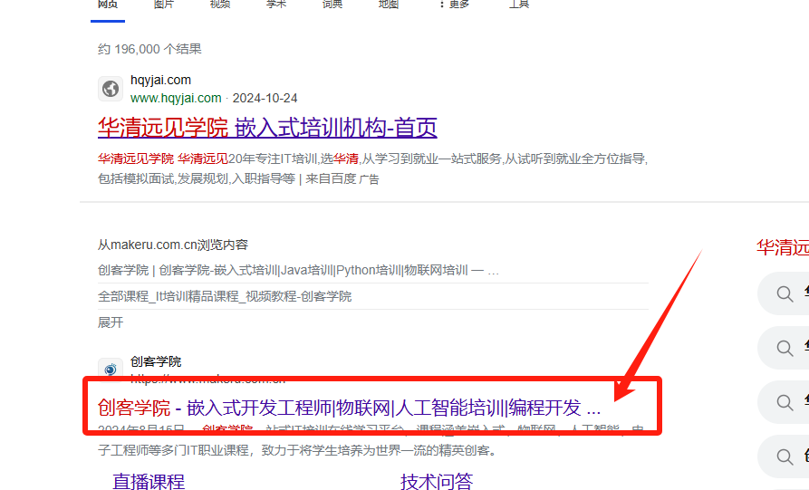
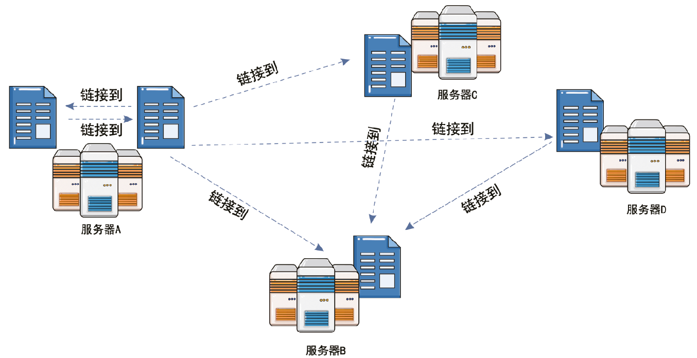
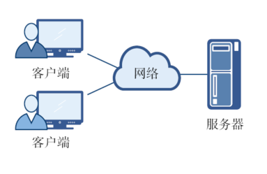
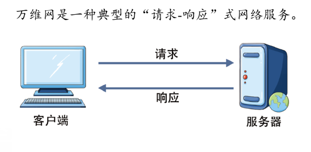
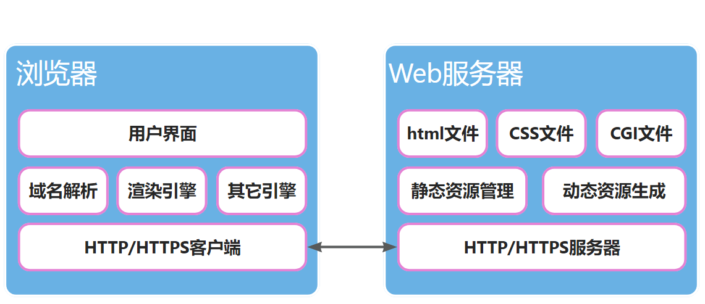

# 万维网的基本工作原理

### 引入

#### 思考：你是如何上网的？



#### 什么是万维网？



### 万维网的基本概念

#### 万维网的特点

- 万维网（World Wide Web, 简称 WWW 或 Web）是一个**大规模的、 联机式的信息储藏所**
- 万维网是一个分布式的**超媒体**(hypermedia)系统， 它是**超文本**(hypertext)系统的扩充。
- 万维网以**客户-服务器**方式工作



#### 什么是URL？

万维网使用**统一资源定位符URL** (Uniform Resource Locator)来标志万维网上的各种文档， 并使每一个文档在整个互联网的范围内具有**唯一的标识符URL**。

```URL
https://www.makeru.com.cn:443/index.html
```

语法规则:

```
scheme://host.domain:port/path/filename
```

- **scheme** - 定义因特网服务的类型。最常见的类型是 `http`
- **host** - 定义域主机（`http` 的默认主机是 `www`）
- **domain** - 定义因特网域名，比如 `makeru.com.cn`
- :**port** - 定义主机上的端口号（`http` 的默认端口号是 `80`）
- **path** - 定义服务器上的路径（如果省略，则文档必须位于网站的根目录中）。
- **filename** - 定义文档/资源的名称

常见的 URL Scheme：

| Scheme    | 访问               | 用于...                               |
| :-------- | :----------------- | :------------------------------------ |
| **http**  | 超文本传输协议     | 以 `http://` 开头的普通网页。不加密。 |
| **https** | 安全超文本传输协议 | 安全网页，加密所有信息交换。          |
| **ftp**   | 文件传输协议       | 用于将文件下载或上传至网站。          |
| **file**  |                    | 您计算机上的文件。                    |

#### HTTP与HTTPS

**HTTP（超文本传输协议，Hypertext Transfer Protocol）** 是一种用于从网络传输超文本到本地浏览器的传输协议。它定义了客户端与服务器之间请求和响应的格式。HTTP 工作在 TCP/IP 模型之上，通常使用端口 **80**。



**HTTPS（超文本传输安全协议，Hypertext Transfer Protocol Secure）** 是 HTTP 的安全版本，它在 HTTP 下增加了 SSL/TLS 协议，提供了数据加密、完整性校验和身份验证。HTTPS 通常使用端口 **443**。


#### 超文本标记语言HTML

**超文本标记语言HTML** (Hyper Text Markup Language)是一种标准化的标记语言，用于创建网页。

它提供了结构性和语义化的标记，使各种浏览器能够渲染不同作者创作的多种风格的文档。

HTML具备一定的灵活性，允许通过CSS（层叠样式表）来实现风格上的差异。

```html
<html>
<body>

<h1 style="text-align:center;">My First Heading</h1>

<p>My first paragraph.</p>

</body>
</html>
```

### 万维网的基本工作原理

