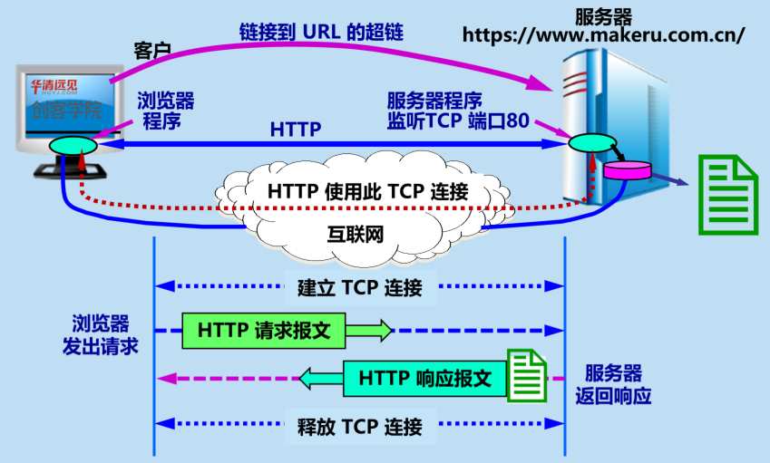
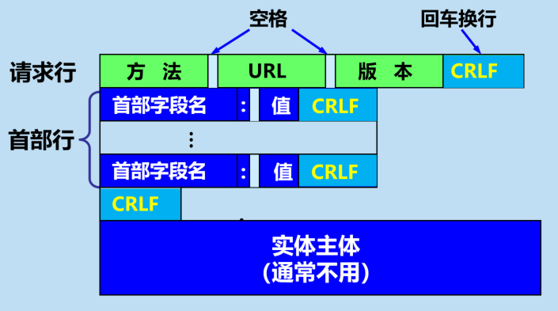
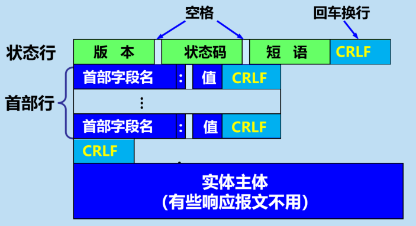

# HTTP协议基本概念

### 什么是HTTP协议？

- **HTTP**（超文本传输协议，HyperText Transfer Protocol）是一种用于分布式、协作式、超媒体信息系统的应用层协议。
- **HTTP** 是**万维网（WWW）的数据通信的基础**，设计目的是确保客户端与服务器之间的通信，是互联网上最常用的协议之一。
- **HTTP** 是一个**基于 TCP/IP 通信协议**来传递数据的（HTML 文件、图片文件、查询结果等）。
- 设计 HTTP 最初的目的是为了提供一种发布和接收 HTML 页面的方法，通过 HTTP 或者 HTTPS 协议请求的资源由统一资源标识符（Uniform Resource Identifiers，URI）来标识。

### HTTP 的请求-响应



- **建立连接**：客户端与服务器之间建立连接。在传统的 **HTTP** 中，这是基于 TCP/IP 协议的。最近的 **HTTP/2** 和 **HTTP/3** 则使用了更先进的传输层协议，例如基于 TCP 的二进制协议（**HTTP/2**）或基于 **UDP** 的 **QUIC** 协议（**HTTP/3**）。
- **发送请求**：客户端向服务器发送请求，请求中包含要访问的资源的 **URL**、请求方法（**GET**、**POST**、**PUT**、**DELETE** 等）、请求头（例如，**Accept**、**User-Agent**）以及可选的请求体（对于 **POST** 或 **PUT** 请求）。
- **处理请求**：服务器接收到请求后，根据请求中的信息找到相应的资源，执行相应的处理操作。这可能涉及从数据库中检索数据、生成动态内容或者简单地返回静态文件。
- **发送响应**：服务器将处理后的结果封装在响应中，并将其发送回客户端。响应包含状态码（用于指示请求的成功或失败）、响应头（例如，Content-Type、Content-Length）以及可选的响应体（例如，HTML 页面、图像数据）。
- **关闭连接**：在完成请求-响应周期后，客户端和服务器之间的连接可以被关闭，除非使用了持久连接（如 **HTTP/1.1** 中的 keep-alive）。

#### 客户端请求消息

客户端发送一个HTTP请求到服务器的请求消息包括以下格式：请求行（request line）、请求头部（header）、空行和请求数据四个部分组成，下图给出了请求报文的一般格式。



示例：

```http
     GET / HTTP/1.1
     User-Agent: curl/7.16.3 libcurl/7.16.3 OpenSSL/0.9.7l zlib/1.2.3
     Host: www.example.com
     Accept-Language: en, mi
```

#### 服务器响应消息

HTTP 响应也由四个部分组成，分别是：状态行、消息报头、空行和响应正文。



示例：

```http
 HTTP/1.1 200 OK
 Date: Mon, 27 Jul 2009 12:28:53 GMT
 Server: Apache
 Last-Modified: Wed, 22 Jul 2009 19:15:56 GMT
 ETag: "34aa387-d-1568eb00"
 Accept-Ranges: bytes
 Content-Length: 143
 Vary: Accept-Encoding
 Content-Type: text/plain
     
     
<!DOCTYPE html>
<html>
<head>
  <meta charset="utf-8">
  <title>创客学院(makeru.com.cn)</title>
</head>
<body>
  <h1>这是一个html</h1>
</body>
</html>

```

### HTTP 请求方法

| 序号 | 方法    | 描述                                                         |
| :--: | ------- | ------------------------------------------------------------ |
|  1   | GET     | 从服务器获取资源。用于请求数据而不对数据进行更改。例如，从服务器获取网页、图片等。 |
|  2   | POST    | 向服务器发送数据以创建新资源。常用于提交表单数据或上传文件。发送的数据包含在请求体中。 |
|  3   | PUT     | 向服务器发送数据以更新现有资源。如果资源不存在，则创建新的资源。与 POST 不同，PUT 通常是幂等的，即多次执行相同的 PUT 请求不会产生不同的结果。 |
|  4   | DELETE  | 从服务器删除指定的资源。请求中包含要删除的资源标识符。       |
|  5   | PATCH   | 对资源进行部分修改。与 PUT 类似，但 PATCH 只更改部分数据而不是替换整个资源。 |
|  6   | HEAD    | 类似于 GET，但服务器只返回响应的头部，不返回实际数据。用于检查资源的元数据（例如，检查资源是否存在，查看响应的头部信息）。 |
|  7   | OPTIONS | 返回服务器支持的 HTTP 方法。用于检查服务器支持哪些请求方法，通常用于跨域资源共享（CORS）的预检请求。 |
|  8   | TRACE   | 回显服务器收到的请求，主要用于诊断。客户端可以查看请求在服务器中的处理路径。 |
|  9   | CONNECT | 建立一个到服务器的隧道，通常用于 HTTPS 连接。客户端可以通过该隧道发送加密的数据。 |

### HTTP 状态码

#### 状态码分类

HTTP 状态码由三个十进制数字组成，第一个十进制数字定义了状态码的类型。响应分为五类：信息响应(100–199)，成功响应(200–299)，重定向(300–399)，客户端错误(400–499)和服务器错误 (500–599)：

| 分类 | 分类描述                                       |
| ---- | ---------------------------------------------- |
|  1   | 信息，服务器收到请求，需要请求者继续执行操作   |
|  2   | 成功，操作被成功接收并处理                     |
|  3   | 重定向，需要进一步的操作以完成请求             |
|  4   | 客户端错误，请求包含语法错误或无法完成请求     |
|  5   | 服务器错误，服务器在处理请求的过程中发生了错误 |

#### HTTP状态码列表

| 状态码 | 状态码英文名称                  | 中文描述                                                     |
| ------ | ------------------------------- | ------------------------------------------------------------ |
| 100    | Continue                        | 继续。客户端应继续其请求                                     |
| 101    | Switching Protocols             | 切换协议。服务器根据客户端的请求切换协议。只能切换到更高级的协议，例如，切换到HTTP的新版本协议 |
|        |                                 |                                                              |
| 200    | OK                              | 请求成功。一般用于GET与POST请求                              |
| 201    | Created                         | 已创建。成功请求并创建了新的资源                             |
| 202    | Accepted                        | 已接受。已经接受请求，但未处理完成                           |
| 203    | Non-Authoritative Information   | 非授权信息。请求成功。但返回的meta信息不在原始的服务器，而是一个副本 |
| 204    | No Content                      | 无内容。服务器成功处理，但未返回内容。在未更新网页的情况下，可确保浏览器继续显示当前文档 |
| 205    | Reset Content                   | 重置内容。服务器处理成功，用户终端（例如：浏览器）应重置文档视图。可通过此返回码清除浏览器的表单域 |
| 206    | Partial Content                 | 部分内容。服务器成功处理了部分GET请求                        |
|        |                                 |                                                              |
| 300    | Multiple Choices                | 多种选择。请求的资源可包括多个位置，相应可返回一个资源特征与地址的列表用于用户终端（例如：浏览器）选择 |
| 301    | Moved Permanently               | 永久移动。请求的资源已被永久的移动到新URI，返回信息会包括新的URI，浏览器会自动定向到新URI。今后任何新的请求都应使用新的URI代替 |
| 302    | Found                           | 临时移动。与301类似。但资源只是临时被移动。客户端应继续使用原有URI |
| 303    | See Other                       | 查看其它地址。与301类似。使用GET和POST请求查看               |
| 304    | Not Modified                    | 未修改。所请求的资源未修改，服务器返回此状态码时，不会返回任何资源。客户端通常会缓存访问过的资源，通过提供一个头信息指出客户端希望只返回在指定日期之后修改的资源 |
| 305    | Use Proxy                       | 使用代理。所请求的资源必须通过代理访问                       |
| 306    | Unused                          | 已经被废弃的HTTP状态码                                       |
| 307    | Temporary Redirect              | 临时重定向。与302类似。使用GET请求重定向                     |
|        |                                 |                                                              |
| 400    | Bad Request                     | 客户端请求的语法错误，服务器无法理解                         |
| 401    | Unauthorized                    | 请求要求用户的身份认证                                       |
| 402    | Payment Required                | 保留，将来使用                                               |
| 403    | Forbidden                       | 服务器理解请求客户端的请求，但是拒绝执行此请求               |
| 404    | Not Found                       | 服务器无法根据客户端的请求找到资源（网页）。通过此代码，网站设计人员可设置"您所请求的资源无法找到"的个性页面 |
| 405    | Method Not Allowed              | 客户端请求中的方法被禁止                                     |
| 406    | Not Acceptable                  | 服务器无法根据客户端请求的内容特性完成请求                   |
| 407    | Proxy Authentication Required   | 请求要求代理的身份认证，与401类似，但请求者应当使用代理进行授权 |
| 408    | Request Time-out                | 服务器等待客户端发送的请求时间过长，超时                     |
| 409    | Conflict                        | 服务器完成客户端的 PUT 请求时可能返回此代码，服务器处理请求时发生了冲突 |
| 410    | Gone                            | 客户端请求的资源已经不存在。410不同于404，如果资源以前有现在被永久删除了可使用410代码，网站设计人员可通过301代码指定资源的新位置 |
| 411    | Length Required                 | 服务器无法处理客户端发送的不带Content-Length的请求信息       |
| 412    | Precondition Failed             | 客户端请求信息的先决条件错误                                 |
| 413    | Request Entity Too Large        | 由于请求的实体过大，服务器无法处理，因此拒绝请求。为防止客户端的连续请求，服务器可能会关闭连接。如果只是服务器暂时无法处理，则会包含一个Retry-After的响应信息 |
| 414    | Request-URI Too Large           | 请求的URI过长（URI通常为网址），服务器无法处理               |
| 415    | Unsupported Media Type          | 服务器无法处理请求附带的媒体格式                             |
| 416    | Requested range not satisfiable | 客户端请求的范围无效                                         |
| 417    | Expectation Failed（预期失败）  | 服务器无法满足请求头中 Expect 字段指定的预期行为。           |
| 418    | I'm a teapot                    | 状态码 418 实际上是一个愚人节玩笑。它在 RFC 2324 中定义，该 RFC 是一个关于超文本咖啡壶控制协议（HTCPCP）的笑话文件。在这个笑话中，418 状态码是作为一个玩笑加入到 HTTP 协议中的。 |
|        |                                 |                                                              |
| 500    | Internal Server Error           | 服务器内部错误，无法完成请求                                 |
| 501    | Not Implemented                 | 服务器不支持请求的功能，无法完成请求                         |
| 502    | Bad Gateway                     | 作为网关或者代理工作的服务器尝试执行请求时，从远程服务器接收到了一个无效的响应 |
| 503    | Service Unavailable             | 由于超载或系统维护，服务器暂时的无法处理客户端的请求。延时的长度可包含在服务器的Retry-After头信息中 |
| 504    | Gateway Time-out                | 充当网关或代理的服务器，未及时从远端服务器获取请求           |
| 505    | HTTP Version not supported      | 服务器不支持请求的HTTP协议的版本，无法完成处理               |