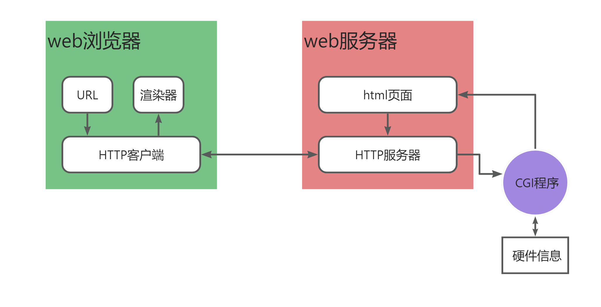

# CGI的引入

### 什么是CGI?

**CGI** 全称为 Common Gateway Interface，是一种标准协议，**定义了Web服务器与外部应用程序**（通常是执行脚本或程序）**之间的交互方式**。其主要作用是在Web服务器和生成动态内容的应用程序之间传递信息。

当用户在Web浏览器中请求一个CGI程序时，Web服务器会将请求传递给相应的CGI脚本。脚本执行完成后，将结果返回给服务器，服务器再将结果传给用户的浏览器。**CGI脚本可以用多种编程语言编写**，如Perl、Python、C、或者Shell脚本。



### cgi接口的引入

```bash
sudo a2enmod cgi
sudo systemctl restart apache2
```

```c
#include <stdio.h>

int main(int argc, char *argv[]) {
    printf("Content-Type: text/html\n\n");
    printf("<!DOCTYPE html>\n");
    printf("<html> <head> <meta charset=\"utf-8\">\n");
    printf("<title>我的html页面</title> </head> <body>\n");
    printf("<h1>第一个标题</h1>\n");
    printf("<p>我的第一个段落。</p>\n");
    printf("</body> </html> \n");
    return 0;
}
```

### 使用shell脚本实现cgi程序
```c
#!/bin/bash
echo "Content-Type: text/html"
echo ""
echo "<!DOCTYPE html>"
echo "<html> <head> <meta charset=\"utf-8\">"
echo "<title>html页面</title> </head> <body>"
echo "<h1>标题</h1>"
echo "<p>我的第一个段落</p>"
echo "</body> </html>"
```

### CGI的特点：
对http浏览器来说，cgi脚本文件只是**一个页面文件**。

CGI可以使用任意编程语言编写，只要这个语言能把数据**输出到标准输出即可**。

CGI是一个标准，它规定了系统所必须具备的**环境变量**

### CGI相关文档
CGI标准官方文档：

[RFC 3875 - The Common Gateway Interface (CGI) Version 1.1 (ietf.org)](https://datatracker.ietf.org/doc/html/rfc3875)

CGI教程：

[C++ Web 编程 | 菜鸟教程 (runoob.com)](https://www.runoob.com/cplusplus/cpp-web-programming.html)

[Python CGI 编程 | 菜鸟教程 (runoob.com)](https://www.runoob.com/python/python-cgi.html)

[Perl CGI编程 | 菜鸟教程 (runoob.com)](https://www.runoob.com/perl/perl-cgi-programming.html)

### <font style="color:rgb(51, 51, 51);">CGI环境变量</font>
| 变量名                                                      | 描述                                                         |
| ----------------------------------------------------------- | ------------------------------------------------------------ |
| <font style="color:rgb(51, 51, 51);">CONTENT_TYPE</font>    | <font style="color:rgb(51, 51, 51);">内容的数据类型。当客户端向服务器发送附加内容时使用。例如，文件上传等功能。</font> |
| <font style="color:rgb(51, 51, 51);">CONTENT_LENGTH</font>  | <font style="color:rgb(51, 51, 51);">查询的信息长度。只对 POST 请求可用。</font> |
| <font style="color:rgb(51, 51, 51);">HTTP_COOKIE</font>     | <font style="color:rgb(51, 51, 51);">以键 & 值对的形式返回设置的 cookies。</font> |
| <font style="color:rgb(51, 51, 51);">HTTP_USER_AGENT</font> | <font style="color:rgb(51, 51, 51);">用户代理请求标头字段，递交用户发起请求的有关信息，包含了浏览器的名称、版本和其他平台性的附加信息。</font> |
| <font style="color:rgb(51, 51, 51);">PATH_INFO</font>       | <font style="color:rgb(51, 51, 51);">CGI 脚本的路径。</font> |
| <font style="color:rgb(51, 51, 51);">QUERY_STRING</font>    | <font style="color:rgb(51, 51, 51);">通过 GET 方法发送请求时的 URL 编码信息，包含 URL 中问号后面的参数。</font> |
| <font style="color:rgb(51, 51, 51);">REMOTE_ADDR</font>     | <font style="color:rgb(51, 51, 51);">发出请求的远程主机的 IP 地址。这在日志记录和认证时是非常有用的。</font> |
| <font style="color:rgb(51, 51, 51);">REMOTE_HOST</font>     | <font style="color:rgb(51, 51, 51);">发出请求的主机的完全限定名称。如果此信息不可用，则可以用 REMOTE_ADDR 来获取 IP 地址。</font> |
| <font style="color:rgb(51, 51, 51);">REQUEST_METHOD</font>  | <font style="color:rgb(51, 51, 51);">用于发出请求的方法。最常见的方法是 GET 和 POST。</font> |
| <font style="color:rgb(51, 51, 51);">SCRIPT_FILENAME</font> | <font style="color:rgb(51, 51, 51);">CGI 脚本的完整路径。</font> |
| <font style="color:rgb(51, 51, 51);">SCRIPT_NAME</font>     | <font style="color:rgb(51, 51, 51);">CGI 脚本的名称。</font> |
| <font style="color:rgb(51, 51, 51);">SERVER_NAME</font>     | <font style="color:rgb(51, 51, 51);">服务器的主机名或 IP 地址。</font> |
| <font style="color:rgb(51, 51, 51);">SERVER_SOFTWARE</font> | <font style="color:rgb(51, 51, 51);">服务器上运行的软件的名称和版本。</font> |
