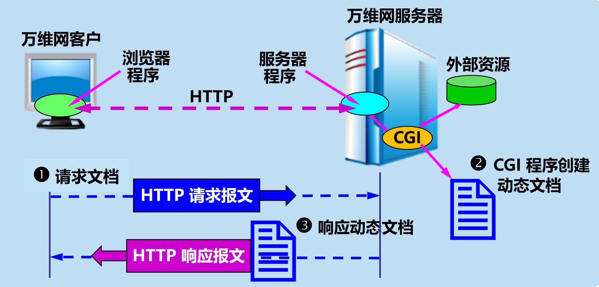

# 复习总结

### CGI与Web服务器

#### CGI与Web服务器的关系



在HTTP请求与CGI脚本的交互中，CGI充当了Web服务器和外部应用程序之间的桥梁，使服务器能够生成动态内容并将其发送回客户端。以下是交互的详细过程：

#### HTTP请求与CGI脚本的交互过程

1. **客户端发起请求**
   - 用户在浏览器中请求一个URL，这个URL指向一个CGI脚本。
   - 该请求可以是GET请求或POST请求。

2. **服务器接收到请求**
   - Web服务器（如Apache或Nginx）接收到HTTP请求后会检查请求的URL。
   - 如果URL对应于CGI脚本的路径，服务器将识别需要启动CGI处理。

3. **调度CGI脚本**
   - 服务器根据请求启动相应的CGI脚本作为新进程运行。
   - 在启动脚本前，服务器设定环境变量，这些变量包含了请求的各种信息。

4. **传递请求数据**
   - **环境变量：** 服务器通过环境变量传递请求的元数据，如请求方法、查询字符串、内容类型等。例如：
     - `REQUEST_METHOD`: 请求方式（如GET、POST）
     - `QUERY_STRING`: URL中的查询字符串
     - `CONTENT_TYPE`: 请求体的数据类型（针对POST请求）
   - **标准输入（stdin）：** 对于POST请求，请求体的数据通过标准输入传递给CGI脚本。

5. **CGI脚本处理请求**
   - CGI脚本读取请求数据和环境变量，并进行相应的数据处理和逻辑操作。
   - 脚本生成输出，包括HTTP头部和内容。常见的首个输出头是`Content-Type`，告知响应数据的类型，例如`Content-Type: text/html`。

6. **返回响应给服务器**
   - 脚本执行完成后，将输出发送回Web服务器。
   - Web服务器将这一输出作为HTTP响应发送回客户端浏览器。

7. **浏览器显示内容**
   - 客户端浏览器接收到响应后，解析并渲染网页内容供用户查看。

总结:

CGI的交互过程依赖于环境变量和标准输入输出，允许服务器动态生成内容处理复杂的用户请求。

### CGI编程

#### C语言实现的CGI脚本的基本结构

使用C语言编写CGI脚本与其他语言有些不同，因为C语言通常需要手动处理输入、输出以及内存管理等。以下是一个简单的C语言CGI脚本的基本结构：

1. **环境设置**：
   - CGI脚本通常位于`/cgi-bin/`目录中，确保你的Web服务器能够执行它。
   - 脚本的文件权限需正确设置，通常需要对执行者可执行（例如，`chmod 755 script.cgi`）。

2. **编写C代码**：
   - 开头包括必要的头文件：
     ```c
     #include <stdio.h>
     #include <stdlib.h>
     ```

3. **输出HTTP头部**：
   - CGI脚本必须首先输出HTTP头部，并以一个空行结束。
   ```c
   printf("Content-Type: text/html\n\n");
   ```

4. **处理输入数据**：
   - 一般使用`GET`或`POST`方法传递数据。
   - 使用环境变量如`QUERY_STRING`来获取`GET`方法传递的参数，或者从标准输入读取`POST`方法的内容。

   例子中处理`GET`请求的查询字符串：
   ```c
   char *query = getenv("QUERY_STRING");
   if (query != NULL) {
       printf("<p>Query string: %s</p>\n", query);
   }
   ```

5. **生成HTML内容**：
   - 输出HTML内容即可，例如：
   ```c
   printf("<html>\n");
   printf("<head><title>CGI Script in C</title></head>\n");
   printf("<body>\n");
   printf("<h1>Hello, CGI in C!</h1>\n");
   printf("</body>\n");
   printf("</html>\n");
   ```

6. **处理`POST`方法输入**：
   - 读取`CONTENT_LENGTH`环境变量确定输入数据的长度，然后使用`fgets`或`fread`从标准输入读取数据。
   ```c
   char *content_length = getenv("CONTENT_LENGTH");
   int len = content_length ? atoi(content_length) : 0;
   if (len > 0) {
       char *post_data = malloc(len+1); // +1 for null-terminator
       fread(post_data, 1, len, stdin);
       post_data[len] = '\0';
       printf("<p>Post data: %s</p>\n", post_data);
       free(post_data);
   }
   ```

完整简单的CGI脚本可能如下：

```c
#include <stdio.h>
#include <stdlib.h>

int main(void) {
    // 输出HTTP头部
    printf("Content-Type: text/html\n\n");

    // 输出HTML页面开始
    printf("<html>\n");
    printf("<head><title>CGI Script in C</title></head>\n");
    printf("<body>\n");

    // 示例欢迎信息
    printf("<h1>Welcome to CGI with C</h1>\n");

    // 处理GET请求参数
    char *query = getenv("QUERY_STRING");
    if (query != NULL) {
        printf("<p>Query string: %s</p>\n", query);
    }

    // 处理POST请求数据
    char *content_length = getenv("CONTENT_LENGTH");
    int len = content_length ? atoi(content_length) : 0;
    if (len > 0) {
        char *post_data = malloc(len + 1);
        fread(post_data, 1, len, stdin);
        post_data[len] = '\0';
        printf("<p>Post data: %s</p>\n", post_data);
        free(post_data);
    }

    // 输出HTML页面结束
    printf("</body>\n");
    printf("</html>\n");

    return 0;
}
```

#### **CGI编程当中的常见错误的处理与调试**

在CGI编程中，处理和调试常见错误是开发过程中非常重要的环节。以下是一些关键技术和步骤，可以帮助你更有效地处理和调试CGI程序中的错误：

1. **检查服务器日志：**
   - 查看Web服务器的错误日志（如Apache的`error.log`），可以找到详细的错误信息。日志文件通常能提供具体的错误描述和发生错误的行号。
2. **正确设置HTTP头：**
   - 确保输出正确的HTTP头。例如，输出内容为HTML时，应该以`Content-type: text/html\r\n\r\n`开头。如果头信息错误，浏览器可能无法正确解析响应内容。
3. **使用标准错误输出：**
   - 将调试信息输出到标准错误（stderr），这样它会被记录到服务器的错误日志中，而不干扰程序的正常输出。
4. **权限问题：**
   - 检查CGI脚本的文件和目录权限。确保Web服务器有足够的权限运行CGI脚本。
5. **本地测试：**
   - 在部署到生产环境之前，先在本地环境中运行和测试CGI脚本，确保其在独立条件下正常运行。
